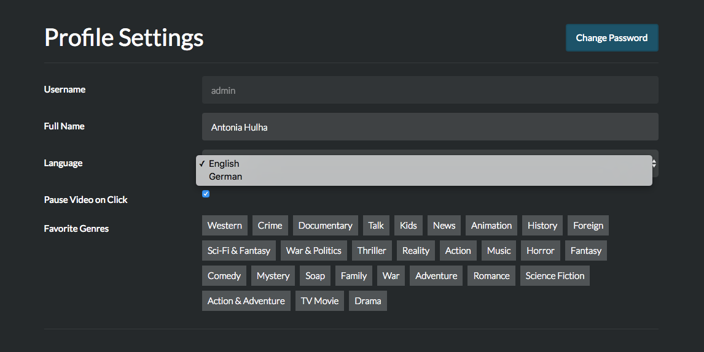
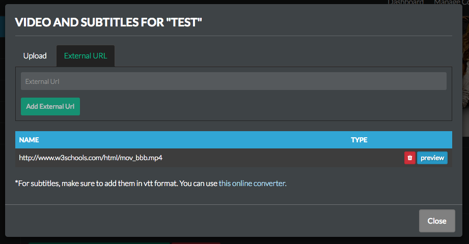

# Change Log

## 0.3.1.RC - 2016-05-18
### Features
- now you dont need to manually parse your SRT files to vtt anymore! the application will do it for you on the fly! 

## 0.3.0.RC1 - 2016-05-15
### Features
- implemented Multilanguage support for the frontend part of the app! Users can choose in their profile which language they want to see. 
Right now, only English is implemented. You are welcome to contribute! Simply add a copy of the fle at  
`/grails-app/assets/javascripts/translations/EN_us.js`, name it with your language token, and translate away! Once you mead a Pull Request 
and it gets approved, the language will be added in the profile language selector.  

- Added Content Highlighting for the Dashboard. You can now present your users with a pretty slideshow  

- We now have a help section in streama with some helpful info and FAQ. Thanks @JanneNiemela !
- Multiple cosmetic changes, thanks @JanneNiemela, @LorenzoGarbanzo, @jsniemela !
- implemented feature to add videos from external URL (http Link)  

## [0.2.0] - 2016-03-08
### Features
- added functionality for "Generic Videos", aka videos that are not necessarily Movies or TV shows
- Added Genres for Movies and shows! When starting the app, it might be slower for the first time because it adds all the genres for existing movies and shows :)
- added filters for dashboard
- immensely improved performance for dashboard
- added file-manager in admin section
- added custom tags for movies
- added more keyboard and mouse controls in player

### Bugfixes
- deleting a file will now erase the file from disk
- fixed: Fetching tv-show information doesn't seem to end #145
- fixed: You can’t save settings if you haven’t selected a second video directory #144
- fixed: play button from media dialog leads to dashboard

## [0.1.9.1] - 2016-01-12
### Bugfixes
- fixed: unable to play videos that users were able to play previously (m4v format)

## [0.1.9] - 2016-01-05
### Features
- continuously show controls if hovered directly over them
- reduced delay for contol hide
- improved detail-display for shows and movies in admin interface
- improved display for movies and shows without files in admin overview page

### Bugfixes
- potential fix for notification email going to spam
- adjusted video response headers to more closely resemple apache2 headers
- bugfix for fetching shows from themoviedb

## [0.1.8] - 2016-01-02
### Features
- Add non-themoviedb shows ((#91)[https://github.com/dularion/streama/issues/91]) including upload for custom poster image

## [0.1.7.1] - 2016-01-02
### Bugfixes
- fixed: I can't add video files to the player ((#107)[https://github.com/dularion/streama/issues/107])

## [0.1.7] - 2015-12-31
### Features
- Sort orders in Dashboard and Content Management: A-Z, Z-A, Recently Released, Recently Added, etc. ([#109](https://github.com/dularion/streama/issues/109))
- TV Series browsing from dashboard (via little i-icon) ([#101](https://github.com/dularion/streama/issues/101))

### Bugfixes
- Cannot delete video with viewing status ([#110](https://github.com/dularion/streama/issues/110))

## [0.1.6.1] - 2015-12-05

### Bugfixes
- improved load time of episodes in admin area ([#103](https://github.com/dularion/streama/issues/103))

## [0.1.6] - 2015-11-17
### Features
- Added functionality to refetch theMovieDb-seasons (to fill up with missing episodes)
- Added functionality to refetch theMovieDb-Meta-Data for single episode
- Improved episode backend with season-tabs
- Added functionality to remove entire seasons
- added search to movie & show backend
- improved episode browser performance

### Bugfixes
- removed faulty redirect logic

## [0.1.5] - 2015-10-24
### Features
- added notification system for your users, that way you can send out notification emails with your new content! 

## [[0.1.4]](https://github.com/dularion/streama/commit/7f2f0b14b02711ed4596bacf59eb94c6081ae2c2) - 2015-08-10
### Features
- added subtitle-upload, subtitles in player & subtitle-controls (currently only .vtt format)
- added improved file-manager modal
- shortened video-urls (using ID instead of hash)
- added error message for mismatching base url in video-player
- created directive for video player
- improved styling for alertify
- added timeline-scrubbing to socket-events for synchronized watching
- possibly added chromecast support for mobile devices
- improved viewingStatus to only fetch videos where files are not empty and sort by lastUpdated

### Bugfixes
- improved httpIntercepter: only add the browserSocketUUID to params, if params already contains the socketSessionId
- improved socket unsubscribe functionality
- fixed several visual bugs

## [[0.1.3]](https://github.com/dularion/streama/commit/b52f98a96a759da1024daad632be382d1cef9b57) - 2015-08-01
### Features
- Added another role, "Content Manager" and improved overall security. Now the following role-schema applies:
  - Users with the role **Admin** can edit Users & Settings. 
  - Users with the role **Content Manager** can edit content. 
  - Users with **both roles** have full rights.

## [[0.1.2]](https://github.com/dularion/streama/commit/68cf2fb474226399e1558c3f1088aff6a49c7328) - 2015-07-31
### Breaking Changes
- Application now ignores settings for storage & API-Key in `config.groovy`. These values can now be adjusted in the user-interface. If the values are empty at first, the user gets redirected to the settings page when trying to access the dashboard. 

### Improvements
- Added server-side validation for the API-Key
- Added server-side validation for the storage-path
