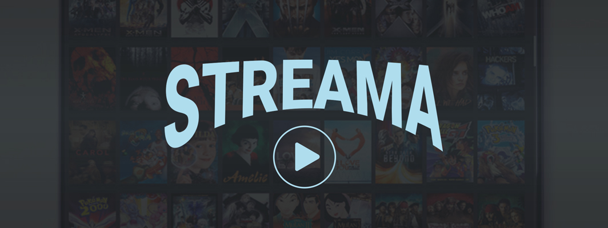

# STREAMA

  

Ever had a huge bookshelf full of shows and movies? Ever wanted to digitalize them, but didn't have a good way of organizing the files? Worry no more! Streama is your own personal Netflix for just such a purpose!

 
 
 

## Donate

If you want to donate to the developer via bitcoin use 17rCUEX6KYQ8ZM4w39ttEUL7SUDnGCpcWq  

## Table of contents:
- [Getting Started](#getting-started)
- [Downloads](#downloads)
- [The Application](#the-application)
  - [Settings](#settings)
  - [The Dashboard](#the-dashboard)
  - [The Player](#the-player)
  - [The Admin-Panel](#the-admin-panel)
  - [The Users](#the-users) 
- [Technical Details](#technical-details)
- [Changelog](#changelog)
- [Roadmap](#roadmap)
- [Known Issues](#known-issues)
- [Contributing](#contributing)
- [License](#license)

# Getting Started
- [Installation and first-time setup](https://github.com/dularion/streama/wiki/Getting-started)

If you have any issues getting started, free free to [chat with us on Gitter](https://gitter.im/dularion/streama). We are more than happy to assist and then improve the docs accordingly. 

# Downloads
- **Stable and beta** versions see the GitHub [releases](https://github.com/dularion/streama/releases)
- **Unstable/alpha** builds see [StreamaBuilds](http://streamabuilds.s3-website-us-east-1.amazonaws.com/)

# The Application

### Settings

When you first run the application, you will be redirected to the settings page. Here you enter your desired upload directory for the video files, your [theMovieDb.org API key](https://www.themoviedb.org/documentation/api) and a different base url if so desired (useful for remote hosting).

Once you made adjustments to any of the settings, make sure to validate the value before saving.
- For the API-Key, the validation checks against theMovieDb.org to see if you've entered a valid API-key.
- For the upload directory, the application checks if it has read/write permissions for it.

### The Dashboard

On the dashboard a user can see their recently watched TV-shows and Movies and their progress (they can continue where they left off) as well start new shows and movies that they haven't yet seen. The "Continue Watching" Feature works by periodically updating the database (only while watching, of course!) with info about the currently watched Video and how far it has been seen.

If a Movie or Episode does not contain any video-files, it won't show up in the dashboard.

### The Player

The Streama-Player is (heavily) inspired by Netflix, so you get all the good stuff from there. For Shows, there is a "next episode" button and a handy episode/season browser. There are also the basics: volume-control, play/pause, and fullscreen. 
Later down the road I will add a feature to add subtitles and switch between video-files (for instance for different quality uploads). 
The player is HTML5-based and has only really been tested in Chrome so far.

##### The Episode Browser
I am especially proud of the Episode-Browser, which aims to function just like on Netflix. By default, the current video-file's season is selected. The user gets an overview of which other episodes there are in the season, how many seasons there are, and, as an added feature, the user sees all the added episodes, even if no video-files are added to them (thus greyed out).

### The Admin-Panel

One of the most important things to me was to make managing shows, movies, and episodes as easy and fun as possible. For this I made heavy use of the API from [theMovieDatabase.org](https://www.themoviedb.org/), which auto-fills the episodes, shows and movies with useful information and great images. This eases the user's role in adding content.

For example, creating a new TV-show and the episodes for the first season looks something like this:

Uploading video-files for each episode is as easy as drag-and-drop!

### The Users

Users can be invited and managed in the admin-panel. By default, they are non-admins, meaning they can only view videos, not create them. You can make them admins with the press of a button. Since there is user-administration in place, I plan on expanding on this a lot! Another feature I want to add is the ability for users to add and administer some form of playlists. There is a lot of potential to make this even better!

# Technical Details
This application is web-based, the server-side is written on [Grails 3](https://grails.org/) with [SpringSecurity](http://projects.spring.io/spring-security/) for login & user-handling. For all the front-end components, [AngularJS](https://angularjs.org/) is used and the player is completely HTML5-based. The application is essentially split into Grails for a REST-API, and AngularJS for the frontend.

Streama uses the [awesome API](https://www.themoviedb.org/documentation/api) from [theMovieDatabase](https://www.themoviedb.org) for all media-metadata.

# Changelog
Please refer to description of each [release](https://github.com/dularion/streama/releases) or the git log.

# Roadmap
Streama is still very much a work-in-progress. We will be adding new features and bug-fixes often, but this is a hobby project for the core-contributers, so the time that we can spend on it is limited.

For all our feature and bug tracking we use the [Issues Section](https://github.com/dularion/streama/issues). Streama's 'roadmap' is currently to work though the feature requests and improvements that are in the issue tracker.  Take a look at the milestones for what we intend to add for upcoming releases.

# Contributing
### Features, Improvements, and Bugfixes
Streama currently only has ~2-3 core-contributers so we are grateful for any extra contributions. Send though a Pull Request and we will review it ASAP.

If you're not sure what to work on, take a look at the [issues](https://github.com/dularion/streama/issues). There's lots to do!

### Translations
If you want to contribute a translation, please follow [the guide here](https://github.com/dularion/streama/wiki/Translating-the-app). 

# Known Issues
- There is no video-conversion currently, meaning you are reliant upon HTML5 browser compatibilities. Server-side conversion is on our roadmap. See Issue [#440](https://github.com/dularion/streama/issues/440)

# License
Streama is distributed under the terms of the MIT license.
See [LICENSE.md](https://github.com/dularion/streama/blob/master/LICENSE.md) for details.
